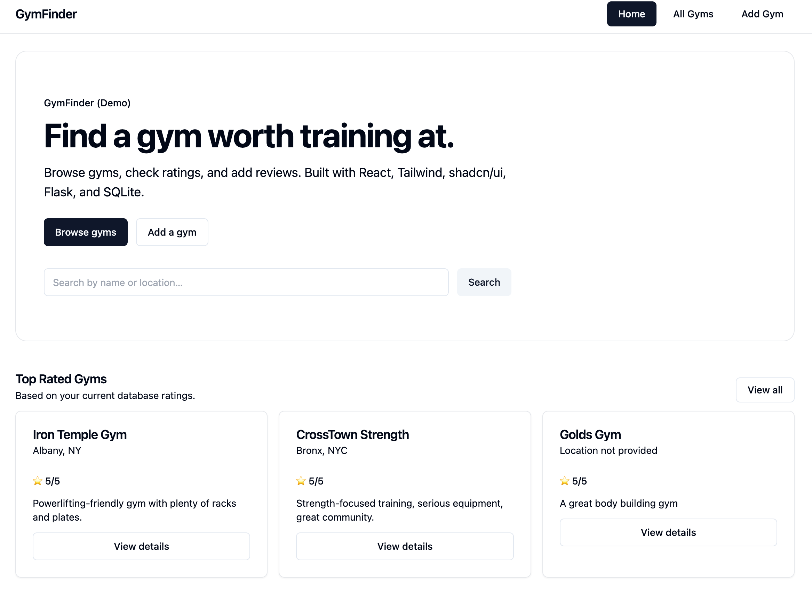
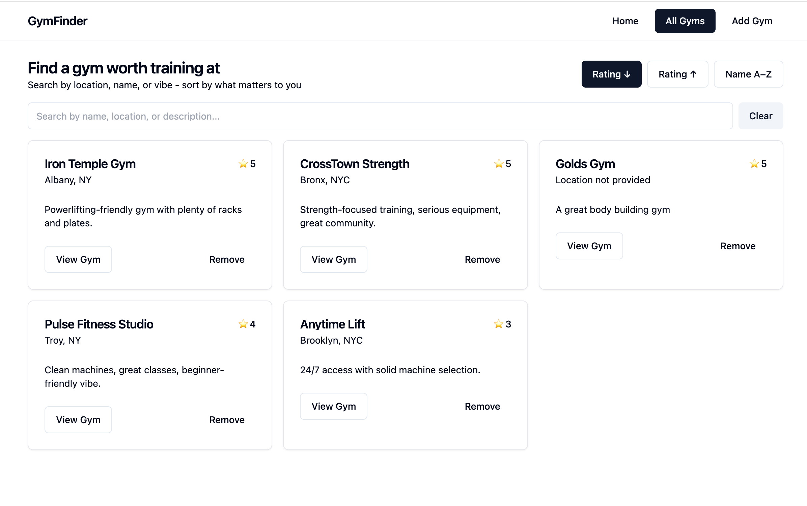
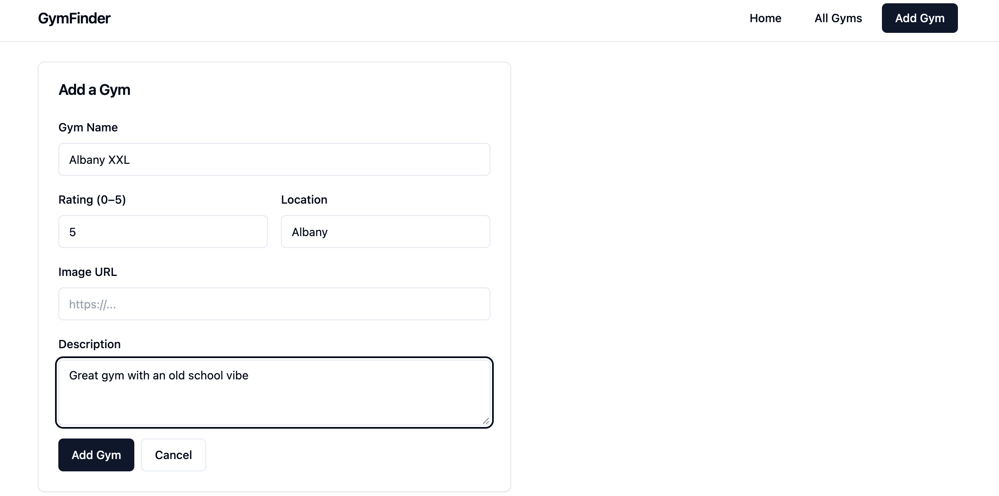
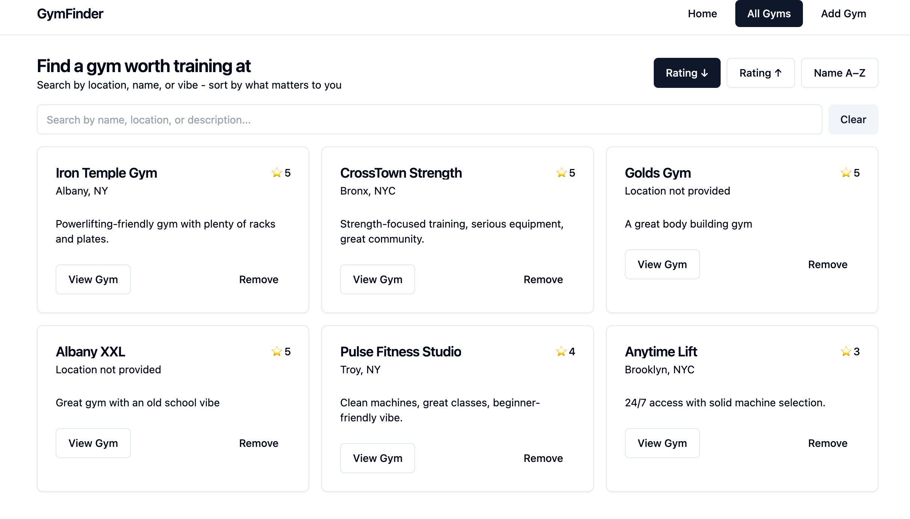
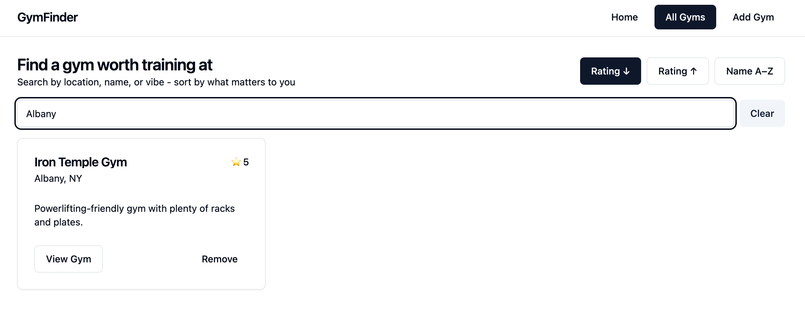

## GymFinder APP

GymFinder is a full-stack web application for discovering, reviewing, and managing gyms.  
Users can browse gyms, view detailed information and reviews, add new gyms, and leave feedback — all through a clean, modern UI.

This project was built to demonstrate full-stack development, RESTful API design, and thoughtful UX.

---

## Features

- Browse gyms with ratings, locations, and descriptions
- Search and sort gyms by name or location
- View detailed gym pages with reviews
- Add new gyms and reviews
- Seed database with demo gym data
- Responsive, modern UI with Tailwind & shadcn/ui

---

## 🛠 Tech Stack

### Frontend 

- React
- React Router
- Tailwind CSS
- shadcn/ui

### Backend 

- Python
- Flask
- Flask-RESTful
- SQLAlchemy
- SQLite
- Alembic (migrations)

---

## 📸 Demo

> Screenshots / demo GIF below

- Home page with hero section and top-rated gyms
- Gyms list with search & sort
- Gym detail page with reviews

_(See demo section below for setup or media)_

---

## ⚙️ Getting Started (Local Setup)

### 1. Clone the repo

```bash
git clone https://github.com/yourusername/gymapp.git
cd gymapp
```

## Backend Setup

```bash
cd server
python -m venv venv
source venv/bin/activate
pip install -r requirements.txt
flask db upgrade
python seed.py
flask run -p 5555

Backend runs on :http://localhost:5555
```

## Frontend Setup 

```bash
cd client
npm install
npm start

Frontend runs on : http://localhost:3000
```

## Project Setup 

gymApp/
├── client/ # React frontend
│ ├── components/
│ ├── ui/
│ └── pages/
├── server/ # Flask backend
│ ├── models.py
│ ├── app.py
│ ├── seed.py
│ └── migrations/

## Key Learnings

- Designing RESTful APIs with FLASK
- Managing relational data with SQLalchemy
- Client-side search and sorting
- UX polish with Tailwind + Shadcn/ui
- Handling empty states and loading states cleanly

## Future Improvements

- Authentication and user accounts
- Map based gym discovery
- Image uploads
- Deployment ( using render/fly.io)

## AUTHOR
Tashi Gyatso
Computer Science @ SUNY ALBANY

# DEMO SECTION

###HOME


### All GYMS



## Adding a gym




## Searching Gym


